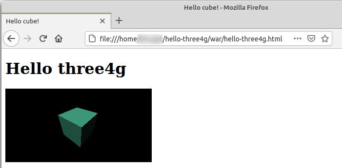
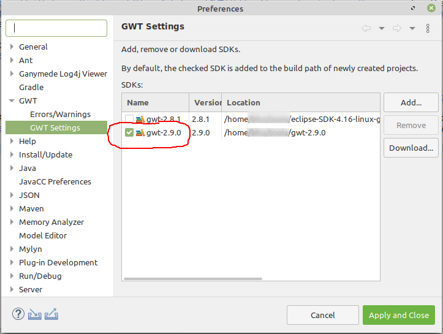

# Hello world in three4g

[three4g](https://github.com/treblereel/three4g) is a [GWT](http://www.gwtproject.org/) wrapper for the 
[threejs](https://threejs.org/) library for [WebGL graphics](https://developer.mozilla.org/en-US/docs/Web/API/WebGL_API) 
in the browser. 

This mini app adapts the rotating cube example from the page 
https://threejsfundamentals.org/threejs/lessons/threejs-fundamentals.html to GWT.

   

## Build

To build the app in Eclipse you need the GWT plugin: https://gwt-plugins.github.io/documentation/gwt-eclipse-plugin/Download.html

Since `three4g` requires at least GWT 2.9, but the plugin installer can only install 2.8.2, you need to 
[download the GWT 2.9](http://www.gwtproject.org/download.html) separately and add the GWT runtime to your plugin:

   

