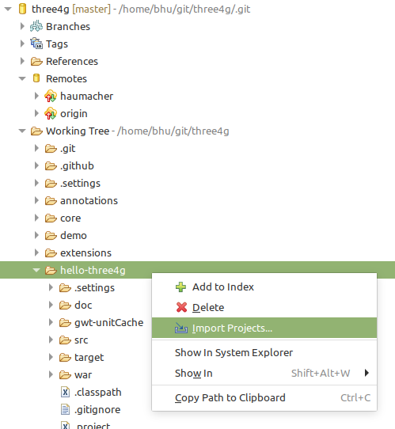
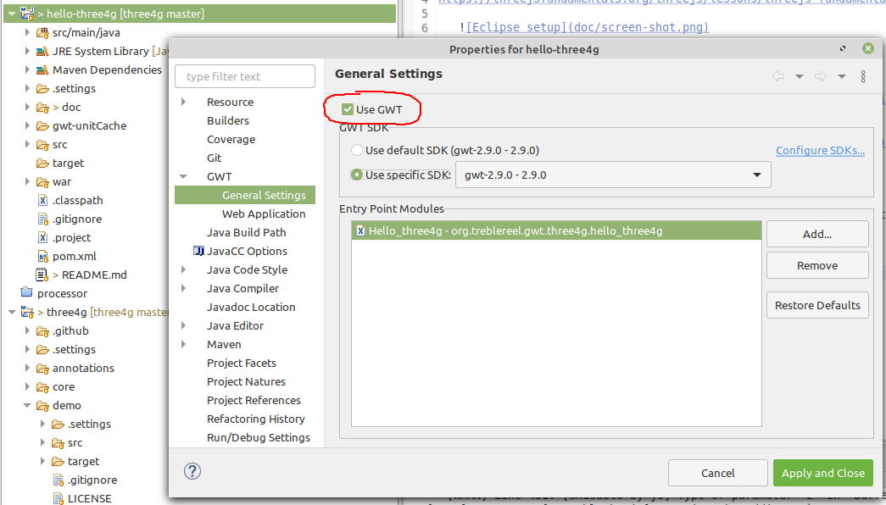

# Hello world in three4g

This mini app adapts the rotating cube example from the page 
https://threejsfundamentals.org/threejs/lessons/threejs-fundamentals.html to GWT.

## Setup in Eclipse

 * Install the GWT plugin in Eclipse: https://gwt-plugins.github.io/documentation/gwt-eclipse-plugin/Download.html

   Since `three4g` requires GWT 2.9, but the plugin installer can only install 2.8.2, you need to 
   [download the GWT 2.9](http://www.gwtproject.org/download.html) separately and add the GWT runtime to your plugin:

      

 * Clone the three4g repository
 * Import `hello-three4g` as project. Since `hello-three4g` is not a child module of `three4g`, you have to explicitly select the `hello-three4g` folder in the repositories view:

      

 * Since the project import does not automatically enable the project's GWT nature, you have to enable it manually.
   Open the GWT settings on the project and enable GWT:
   
      
      
 * Now you are able to build the project. Choose `GWT/Compile` from the project's menu.
 * If the compiler reports success, you have a new folder `/hello-three4g/war/hello_three4g` with the compilation 
   results. You can now open `/hello-three4g/war/hello-three4g.html` in the browser and look at the cube rotating.
   
      

